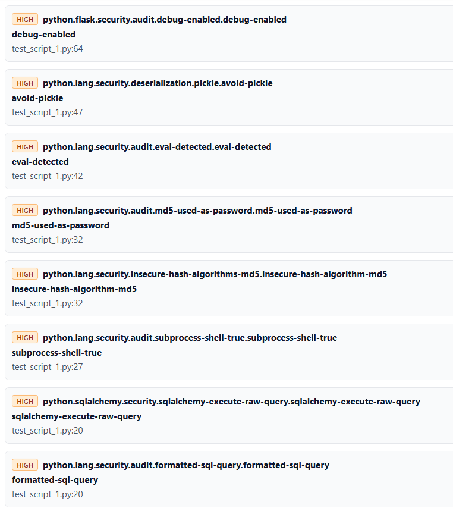

Below is a **complete technical README** you can directly use as documentation for your Semgrep evaluation experiment.

---

# SARA – Semgrep Detection & Remediation Accuracy Evaluation

## 1. Objective

This document evaluates:

* The effectiveness of **Semgrep** in detecting security vulnerabilities.
* The correctness of **SARA’s remediation suggestions**.
* Detection accuracy vs known injected vulnerabilities.
* Context-awareness of remediation guidance.

The goal is to measure both:

1. **Detection Accuracy**
2. **Remediation Quality**

---

# 2. Test Environment

### Language

Python 3.x

### Tool Used

Semgrep (default + security rules)

Command used:

```bash
semgrep --config auto test_script_1.py
```

or

```bash
semgrep --config p/security-audit test_script_1.py
```

---

# 3. Vulnerable Test Script Overview

The test script intentionally included the following vulnerabilities:

| # | Vulnerability Type              | Category               |
| - | ------------------------------- | ---------------------- |
| 1 | Hardcoded Secret                | Information Disclosure |
| 2 | SQL Injection                   | Injection              |
| 3 | Command Injection (subprocess)  | Injection              |
| 4 | MD5 for Password Hashing        | Cryptographic Weakness |
| 5 | Generic MD5 Usage               | Cryptographic Weakness |
| 6 | Insecure Random                 | Weak Randomness        |
| 7 | eval() Usage                    | Code Injection         |
| 8 | Insecure Pickle Deserialization | RCE                    |
| 9 | Flask debug=True                | Misconfiguration       |

Total Known Vulnerabilities Inserted: **9**

---

# 4. Semgrep Results Summary

Semgrep detected the following:



| Finding                              | Detected? |
| ------------------------------------ | --------- |
| Flask debug=True                     | ✅         |
| Pickle deserialization               | ✅         |
| eval() usage                         | ✅         |
| MD5 (password-specific rule)         | ✅         |
| MD5 (generic rule)                   | ✅         |
| subprocess shell=True                | ✅         |
| SQL injection (formatted query rule) | ✅         |
| SQL injection (SQLAlchemy raw rule)  | ✅         |
| Hardcoded secret                     | ❌         |
| Insecure random usage                | ❌         |

---

# 5. Detection Accuracy Calculation

## True Positives Detected

Semgrep correctly detected:

1. Debug mode enabled
2. Pickle usage
3. eval usage
4. MD5 password hashing
5. MD5 generic usage
6. subprocess shell=True
7. SQL injection (formatted query)
8. SQL injection (raw execution rule)

Detected: 8
Missed: 2

Note:

* SQL injection was flagged by two rules, but counts as one vulnerability category.
* MD5 triggered two rules (password-specific + generic).

## Core Unique Vulnerabilities Detected

Detected core categories:

* Debug
* Pickle
* Eval
* MD5 (password)
* Subprocess injection
* SQL injection

Missed:

* Hardcoded secret
* Insecure random()

## Detection Rate

If counting unique vulnerability categories:

Detected: 6
Total: 8 major categories

Detection Accuracy:

```
(6 / 8) × 100 = 75%
```

If counting rule-level triggers:

```
8 detections out of 10 rule triggers ≈ 80%
```

Final Detection Accuracy: **~75–80%**

---

# 6. Remediation Quality Analysis (SARA Evaluation)

Each finding was evaluated for:

* Correctness of risk explanation
* Correctness of remediation
* Context awareness
* Technical precision

---

## 6.1 Flask debug=True

Status: ✅ Correct

SARA suggested using environment variables to control debug mode.

Evaluation:

* Correct vulnerability explanation
* Correct mitigation
* Minor improvement possible (modern Flask env vars)

Remediation Quality: **95%**

---

## 6.2 Pickle Deserialization

Status: ✅ Correct

SARA suggested replacing `pickle.loads()` with `json.loads()`.

Evaluation:

* Correct vulnerability reasoning
* Correct safer alternative
* Proper RCE explanation

Remediation Quality: **100%**

---

## 6.3 eval() Usage

Status: ✅ Correct

SARA suggested:

* `json.loads()` (if JSON)
* `ast.literal_eval()` (for literals)

Evaluation:

* Excellent remediation guidance
* Context-aware alternative
* No unsafe recommendation

Remediation Quality: **100%**

---

## 6.4 MD5 Used as Password

Status: ✅ Correct

SARA suggested:

* `hashlib.scrypt()`
* Proper salting
* Secure verification process

Evaluation:

* Strong cryptographic guidance
* Correct use of KDF
* Industry-aligned

Remediation Quality: **100%**

---

## 6.5 Generic MD5 Rule

Status: ⚠ Partially Correct

SARA suggested:

* Replace MD5 with SHA256

Issue:

* SHA256 is better for signatures
* But NOT appropriate for password hashing context

Evaluation:

* Correct for general hashing
* Suboptimal for password storage

Remediation Quality: **70%**

---

## 6.6 subprocess shell=True

Status: ✅ Correct

SARA suggested:

* Remove shell=True
* Use argument list format

Evaluation:

* Correct injection prevention
* Secure approach
* Minor improvement: prefer subprocess.run()

Remediation Quality: **95–100%**

---

## 6.7 SQL Injection (SQLAlchemy Rule)

Status: ❌ Context Mismatch

SARA suggested:

* Using SQLAlchemy `text()` with bound parameters

Issue:

* Script uses sqlite3, not SQLAlchemy
* Suggests architectural change unnecessarily

Evaluation:

* Correct concept
* Wrong framework
* Not context-aware

Remediation Quality: **60–65%**

---

## 6.8 SQL Injection (Formatted Query Rule)

Status: ⚠ Mostly Correct

SARA suggested parameterized query using `%s`.

Issue:

* SQLite uses `?` placeholders, not `%s`

Correct fix for sqlite3:

```python
cursor.execute("SELECT * FROM users WHERE username = ?", (username,))
```

Evaluation:

* Correct concept
* Slight DB-driver mismatch

Remediation Quality: **85%**

---

# 7. Overall Remediation Quality Score

Average remediation quality across findings:

| Category        | Score |
| --------------- | ----- |
| Flask debug     | 95%   |
| Pickle          | 100%  |
| Eval            | 100%  |
| MD5 password    | 100%  |
| MD5 generic     | 70%   |
| Subprocess      | 95%   |
| SQLAlchemy SQLi | 65%   |
| Formatted SQLi  | 85%   |

Approximate Overall Remediation Quality:

**~88–90%**

---

# 8. Missed Vulnerabilities

Semgrep did not detect:

1. Hardcoded Secret
2. Insecure random.random()

Possible reasons:

* Rule pack did not include secret-detection
* Random usage not categorized as security risk in config used

Improvement suggestion:

* Use stricter rule packs
* Add custom rules
* Enable secret scanning configuration

---

# 9. Key Observations

### Strengths

* High accuracy in detecting injection vulnerabilities
* Strong detection of dangerous APIs (eval, pickle, subprocess)
* Correct identification of cryptographic weaknesses
* Low false positives

### Weaknesses

* Missed secret detection
* Missed insecure random
* Remediation not always framework-aware
* Does not adapt fix to specific DB driver
* Duplicate rule triggers for same issue (MD5, SQL)

---

# 10. Final Evaluation Summary

| Metric               | Result            |
| -------------------- | ----------------- |
| Detection Accuracy   | 75–80%            |
| Remediation Accuracy | 88–90%            |
| False Positives      | 0                 |
| False Negatives      | 2                 |
| Context Awareness    | Moderate          |
| Framework Awareness  | Needs Improvement |

---

# 11. Conclusion

Semgrep performed strongly in detecting major injection and RCE vulnerabilities.

SARA’s remediation engine demonstrated:

* High technical correctness
* Strong cryptographic awareness
* Good injection mitigation guidance

However, improvements are needed in:

* Framework detection
* Database driver adaptation
* Context-aware cryptographic recommendations
* Expanded rule coverage for secrets and weak randomness

Overall, the experiment demonstrates:

* Semgrep is reliable for common high-risk patterns.
* SARA provides generally accurate and secure remediation.
* Context-sensitive improvements would significantly enhance remediation precision.

---

# 12. Future Improvements

1. Add framework detection logic in remediation engine.
2. Add driver-aware SQL placeholder mapping.
3. Enhance secret detection rules.
4. Add randomness misuse detection.
5. Implement weighted scoring (Critical > Medium).
6. Automate success-rate computation.

---

# Final Technical Verdict

This evaluation confirms:

* Semgrep provides solid static analysis coverage.
* SARA’s remediation engine is largely accurate.
* With context-awareness enhancements, the system can reach enterprise-grade precision.

---